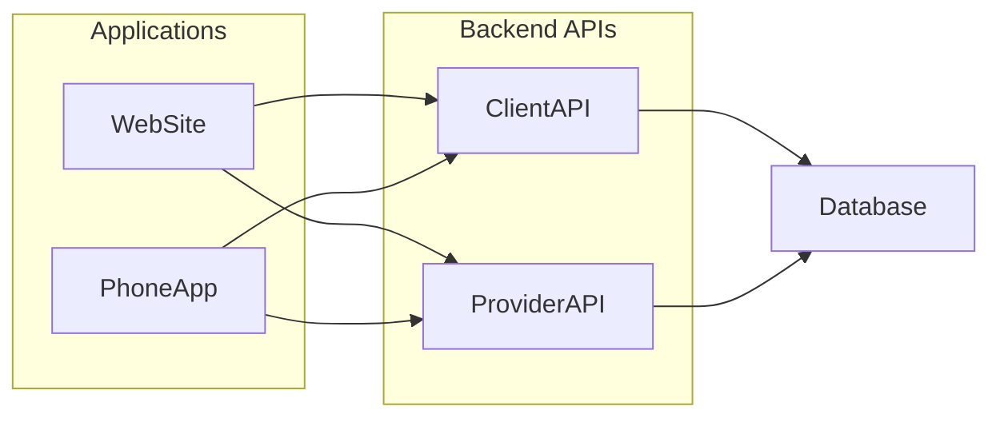
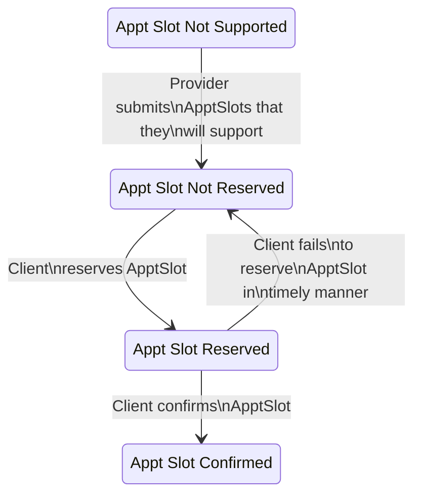

# AwesomeMeds - Overview
A ficticious backend for a scheduling system that services both Providers and Clients.  

# Actors

* Providers - provide medical services to clients
* Clients - consume medical services offered by providers

# User Stories

## User Stories - Providers

- As a Provider, I can submit time windows that I am able to host appointments

## User Stories - Clients
- As a Client, I can view available appointment slots within a time window that is at least 24 hours into the future
- As a Client, I can reserve an appointment slot
- As a Client, I can confirm an appointment reservation

# System Design

The system is comprised of one or more applications (website, phoneapp, etc.) that access the bakend APIs.  The bulk of the calendar functionality and business logic is performed in the backend APIs.  Two APIs (ClientAPI & ProviderAPI) run to increase the resiliency of an error/outage in one API doesn't prohibit the proper operation of the other use cases.  For example, if the ProviderAPI suffers an outage or bug the Provider User Stories won't function.  With a separate ClientAPI, it's more likely the Client User Stories can still operate.


An ACID compliant database, like PostgreSQL, will allow for the intercommunication between the different actors and their comingled User Stories.

# Languages Chosen
- .NET for APIs --> it's what I have the most experience in and currently used by HenryMeds
- SQL Server for Database --> it's what I have the most experience in and similar to PostgreSQL since SQL Server is also an RDBMS

# AppointmentSlot State Diagram
Here is the lifecycle of an appointment slot (a specific 15 minute increment supported by a Provider).


Here is how those states are represented in the database:
- State: Appt Slot Not Supported -- there is not a row in the `[Provider].[AppointmentSlot]` table
- State: Appt Slot Not Reserved -- there is a row in `[Provider].[AppointmentSlot]`, but no row in neither `[Client].[PendingReservationAppointmentSlot]` nor `[Client].[ConfirmedAppointmentSlot]`
- State: Appt Slot Reserved -- there is a row in `[Provider].[AppointmentSlot]` and `[Client].[PendingReservationAppointmentSlot]`, but no row in `[Client].[ConfirmedAppointmentSlot]`
- State: Appt Slot Confirmed -- there is a row in `[Provider].[AppointmentSlot]`, `[Client].[PendingReservationAppointmentSlot]`, and `[Client].[ConfirmedAppointmentSlot]`

# .NET Projects
* `AwesomeMeds.Providers.BusinessLayer` - Business level workflows to facilitate Provider User Stories
* `AwesomeMeds.Providers.BusinessLayer.Test` - Tests for `AwesomeMeds.Providers.BusinessLayer`
* `AwesomeMeds.Providers.DataAccessLayer` - Abstracted access to Provider data stores (the database)
* `AwesomeMeds.Clients.BusinessLayer` - Business level workflows to facilitate Client User Stories
* `AwesomeMeds.Clients.BusinessLayer.Test` - Tests for `AwesomeMeds.Clients.BusinessLayer`
* `AwesomeMeds.Clients.DataAccessLayer` - Abstracted access to Client data stores (the database)
* `AwesomeMeds.Workflows`

# Initialization
Follow these steps to initialize the environment.

## Initialization - Database

1. Create a SQL Server Database called `AwesomeMeds`.
2. Open the `AwesomeMeds.sln` file in Visual Studio.
3. Using the Solution Explorer, navigate to the `AwesomeMeds.sqlproj`.
4. Publish the `AwesomeMeds.sqlproj` against the newly created `AwesomeMeds` database.
    1. Note you will need to change the connection string to point to the newly created database.
5. Execute the [ClearAndInsertSampleData database seeding script](/Databases/AwesomeMeds/dbo/Stored%20Procedures/ClearAndInsertSampleData.sql).  This creates the following Clients and Providers.

| ClientID GUIDs                       |
| -----------------------------------  |
| 11111111-1111-1111-1111-111111111111 |
| 22222222-2222-2222-2222-222222222222 |

| ProviderID GUIDs                     | 
| ------------------------------------ | 
| 33333333-3333-3333-3333-333333333333 | 
| 44444444-4444-4444-4444-444444444444 | 

## Initialization - API
1. Set the environment variable `AWESOME_MEDS_DB_CONNECTION` = `<your-database-connection-string>`.  The environment variable will be used in place of an encrypted key store.
2. Restart Visual Studio to pick up the new environment variable.

# Testing
Follow these steps to test the user stories

## Testing User Stories - As a Provider, I can submit time windows that I am able to host appointments

### Test 1
Exercise this endpoint `PUT - https://localhost:44381/Provider/appointment-slots` with this argument:

```json
{
  "providerId": "33333333-3333-3333-3333-333333333333",
  "startAppointmentSlot": {
    "year": 2024,
    "month": 1,
    "day": 1,
    "hour": 8,
    "quarterHourSegment": 0
  },
  "endAppointmentSlot": {
    "year": 2024,
    "month": 1,
    "day": 1,
    "hour": 12,
    "quarterHourSegment": 0
  }
}
```
Note "providerId": "33333333-3333-3333-3333-333333333333" was setup by `Initialization - Database` section above.

### Test 1 Verification
- Verify: 200 status code is returned
- Verify: This SQL query `SELECT * FROM [AwesomeMeds].[Provider].[AppointmentSlot]` returns this data

|ProviderID	                            |Year	|Month	|Day|Hour|QuarterHourSegment|
|---------------------------------------|-------|-------|---|----|-|
| 33333333-3333-3333-3333-333333333333	| 2020	| 1	    | 1	|8	 |0|
| 33333333-3333-3333-3333-333333333333	| 2020	| 1	    | 1	|8	 |1|
| 33333333-3333-3333-3333-333333333333	| 2020	| 1	    | 1	|8	 |2|
| 33333333-3333-3333-3333-333333333333	| 2020	| 1	    | 1	|8	 |3|
| 33333333-3333-3333-3333-333333333333	| 2020	| 1	    | 1	|9	 |0|
| 33333333-3333-3333-3333-333333333333	| 2020	| 1	    | 1	|9	 |1|
| 33333333-3333-3333-3333-333333333333	| 2020	| 1	    | 1	|9	 |2|
| 33333333-3333-3333-3333-333333333333	| 2020	| 1	    | 1	|9	 |3|
| 33333333-3333-3333-3333-333333333333	| 2020	| 1	    | 1	|10	 |0|
| 33333333-3333-3333-3333-333333333333	| 2020	| 1	    | 1	|10	 |1|
| 33333333-3333-3333-3333-333333333333	| 2020	| 1	    | 1	|10	 |2|
| 33333333-3333-3333-3333-333333333333	| 2020	| 1	    | 1	|10	 |3|
| 33333333-3333-3333-3333-333333333333	| 2020	| 1	    | 1	|11	 |0|
| 33333333-3333-3333-3333-333333333333	| 2020	| 1	    | 1	|11	 |1|
| 33333333-3333-3333-3333-333333333333	| 2020	| 1	    | 1	|11	 |2|
| 33333333-3333-3333-3333-333333333333	| 2020	| 1	    | 1	|11	 |3|

- Verify running the same endpoint with the same argument again  fails b/c the time windows would have conflicting database entries
- Verify an invalid ProviderID returns 400 error code


### Test 2
This performs a similar test as Test 1, but does so with a different provider. The appointment slots are slightly overlapped so from the Client side they should see the union of the two.

Exercise this endpoint `PUT - https://localhost:44381/Provider/appointment-slots` with this argument (note different ProviderID and time starts at 10 hours and goes to 14 hours):

```json
{
  "providerId": "44444444-4444-4444-4444-444444444444",
  "startAppointmentSlot": {
    "year": 2024,
    "month": 1,
    "day": 1,
    "hour": 10,
    "quarterHourSegment": 0
  },
  "endAppointmentSlot": {
    "year": 2024,
    "month": 1,
    "day": 1,
    "hour": 14,
    "quarterHourSegment": 0
  }
}
```
### Test 2 Verification
Verfiy: Exercise this endpoint `GET https://localhost:7258/Client` and verify that 24 results are returned.  Note that Providers 33333333-3333-3333-3333-333333333333 and 44444444-4444-4444-4444-444444444444 had overlapping times, and the Client would only need to know that at least 1 provider is available.


## Testing User Stories - As a Client, I can view available appointment slots within a time window that is at least 24 hours into the future

### Test 3
Exercise this endpoint `GET https://localhost:7258/Client`

### Test 3 Verification
Verify that 24 results are returned. Note that Providers 33333333-3333-3333-3333-333333333333 and 44444444-4444-4444-4444-444444444444 had overlapping times, and the Client would only need to know that at least 1 provider is available.

## Testing User Stories - As a Client, I can reserve an appointment slot


# Note about Exception Handling
For expediency I am throwing exceptions and wrapping all the top level API calls in try/catch blocks.  Normally we could avoid exceptions for many circumstances (eg. bad data coming in from the API) that can be covered with branching logic and proper defensive coding, and provide more elegant loging and reporting to provide feedback to the system maintainers and the applications that send requests to the APIs. But for this exercise with time considerations, we will throw exceptions at any level of the code and catch them in the controllers to be logged and avoid leaking sensitive details to the applications which could increase an attacker's ability to gain knowledge about the system.

